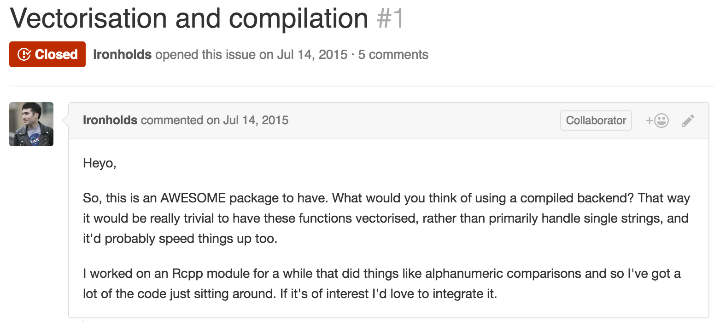

## Agenda

* Introduction
    * About me
    * What is `pystr`?
* Why did I build `pystr`?
    * Python vs. R: a few examples
* Rcpp
    * The beginning
    * Why is it relevant to `pystr`?
    * Example
    * We need your help!
* Conclusion

# Introduction

## About me

* BS in Economics from LSU
* MS in Analytics from UT Austin
* Data Scientist at Neo4j
* I like R and Python equally

## What is `pystr`?

### A port of (most) Python string methods to R

<h3 align="center">
<code>str.method() --> pystr_method()</code>
</h3>

### For example...

<h3 align="center">
<code>str.count(substr) --> pystr_count(str, substr)</code>
</h3>

### It's on CRAN

```{r, eval=FALSE}
install.packages("pystr")
```
```{r, echo=FALSE}
library(pystr)
```

# Why did I build pystr?

## Split a string | The Python Way

```{python}
url = "www.example.com"
print(url.split("."))
```

## Split a string | The R Way

```{r}
url = "www.example.com"

strsplit(url, ".")
```

Ugh. `?strsplit`

```{r}
url = "www.example.com"

strsplit(url, ".", fixed=TRUE)
```

## Split a string | The `pystr` Way

```{r}
url = "www.example.com"

pystr_split(url, ".")
```

## Check if a string begins with a substring | The Python Way

```{python}
url = "http://www.neo4j.com"
print(url.startswith("https://"))
```

## Check if a string begins with a substring | The R Way

```{r}
url = "http://www.neo4j.com"
substring(url, 1, nchar("https://") - 1) == "https://"
```

## Check if a string begins with a substring | The `pystr` Way

```{r}
url = "http://www.neo4j.com"
pystr_startswith(url, "https://")
```

## Substitute the first n occurrences of a substring | The Python Way

```{python}
s = "All I do is win, win, win no matter what..."
print(s.replace("win", "lose", 2))
```

## Substitute the first n occurrences of a substring | The R Way

```{r}
s = "All I do is win, win, win no matter what..."
count = 0

while (count < 2) {
  s = sub("win", "lose", s)
  count = count + 1
}

s
```

## Substitute the first n occurrences of a substring | The `pystr` Way

```{r}
s = "All I do is win, win, win no matter what..."
pystr_replace(s, "win", "lose", 2)
```

## Determine which substring occurs latest in the string | The Python Way

```{python}
s = "3 + 3 + 1 > 5"
print(s.rfind(">") > s.rfind("+"))
```

## Determine which substring occurs latest in the string | The R Way

```{r}
s = "3 + 3 + 1 > 5"
max(gregexpr(">", s)[[1]]) > max(gregexpr("\\+", s)[[1]])
```

## Determine which substring occurs latest in the string | The `pystr` Way

```{r}
s = "3 + 3 + 1 > 5"
pystr_rfind(s, ">") > pystr_rfind(s, "+")
```

## Format a string | The Python Way

```{python}
s = "The name is {last}. {first} {last}."
print(s.format(first="James", last="Bond"))
```

## Format a string | The R Way

```{r}
first = "James"; last = "Bond"
paste0("The names is ", last, ". ", first, " ", last, ".")
```

```{r}
first = "James"; last = "Bond"
sprintf("The name is %s. %s %s.", last, first, last)
```

## Format a string | The `pystr` Way

```{r}
s = "The name is {last}. {first} {last}."
pystr_format(s, first="James", last="Bond")
```

# Rcpp

## The beginning

<figure align="center">

</figure>

## What is it?

Rcpp integrates C++ into R easily.

## Example

```
// [[Rcpp::export]]
IntegerVector pystr_count_(CharacterVector strs, std::string sub, int start, int end) {
  int input_size = strs.size();
  IntegerVector output(input_size);

  for(int i = 0; i < input_size; i++){
    if(strs[i] == NA_STRING){
      output[i] = NA_INTEGER;
    } else {
      output[i] = str_count(Rcpp::as<std::string>(strs[i]), sub, start, end);
    }
  }

  return output;
}
```

## Example

```{r, eval=FALSE}
pystr_count <- function(str, sub, start=1, end=max(nchar(str))) {
  return(pystr_count_(str, sub, start - 1, end - 1))
}
```

## We need your help!

### `github.com/nicolewhite/pystr`

# Conclusion

## R is unfriendly sometimes

<figure align="center">

<figcaption>Me navigating base R string operations</figcaption>
</figure>
